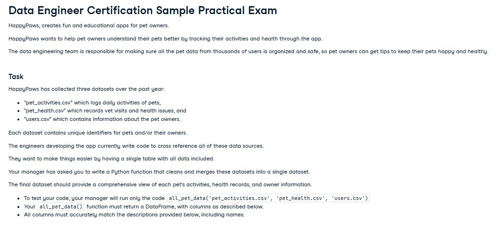
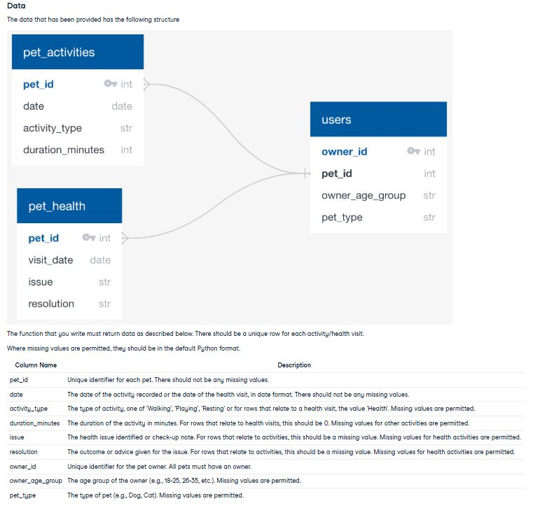
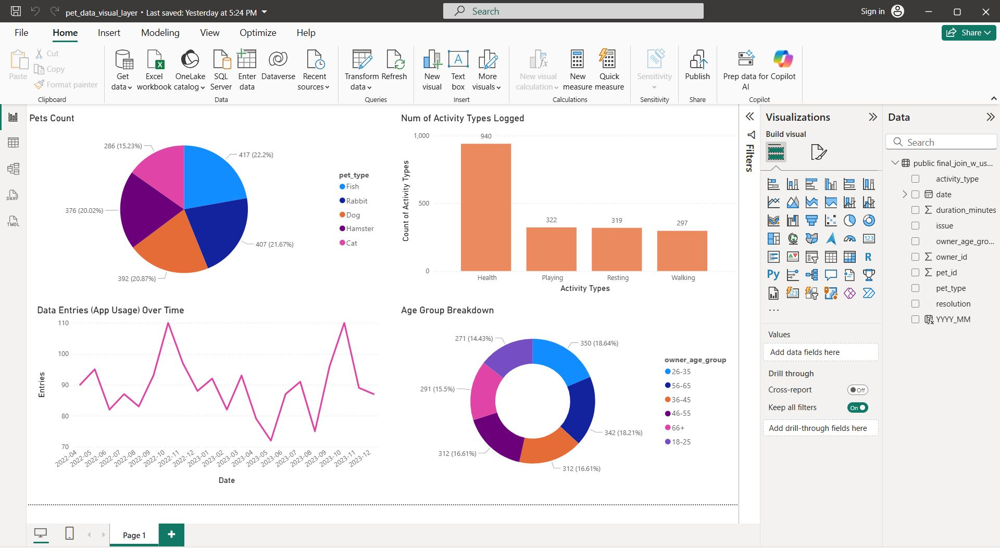
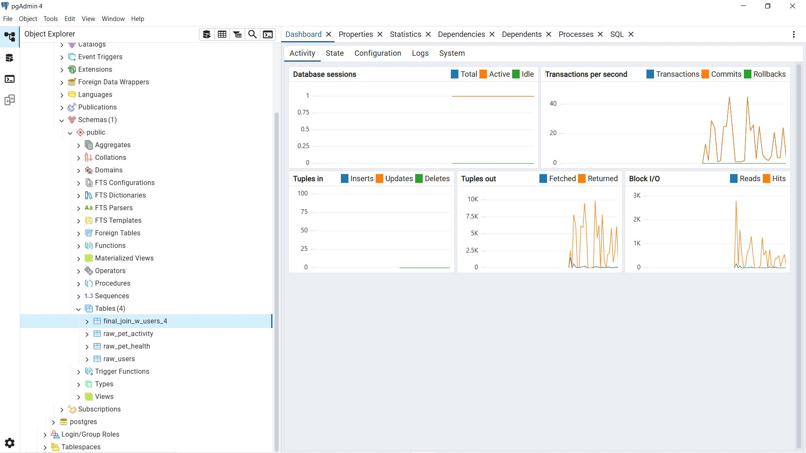
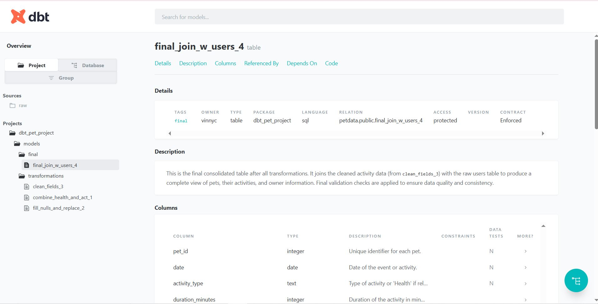
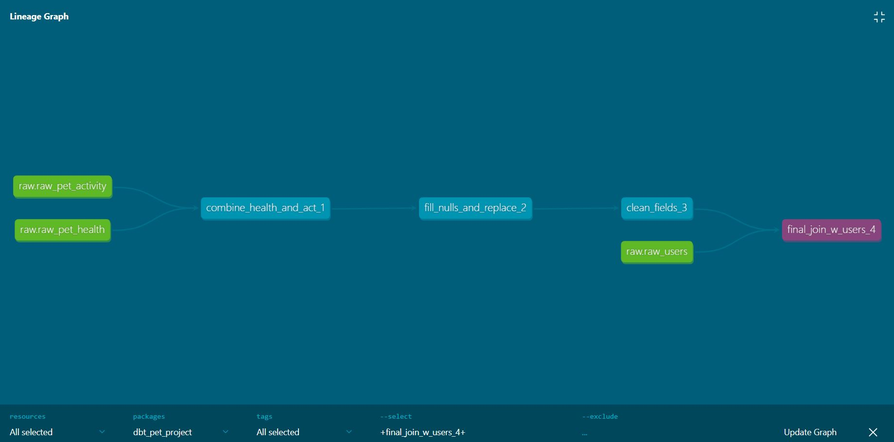

# DBT + Postgres Pet Data Pipeline

## Description
This project demonstrates a structured ELT pipeline using **dbt** and **PostgreSQL** for pet health, user and activity data.  

- Raw data is ingested into staging tables.  
- Transformations are performed via modular dbt models with stepwise dependencies.  
- Column-level tests (`not_null`) ensure data quality at needed stages.  
- Power BI for visual validation, PostgreSQL pgAdmin for inspecting tables, and dbt documentation commands for generating schema docs.
- The pipeline highlights proper modeling, documentation, and dependency management in dbt without requiring external orchestration tools.  

## Features
- Staging models for raw ingestion tables: `raw_pet_health`, `raw_pet_activity`, `raw_users`   
- Incremental transformations building on previous dbt models  
- Column-level testing (`not_null`) for critical fields  
- Full dbt documentation generation (`dbt docs`) with sources and models  
- Modular, readable SQL models designed for downstream analytics  
- Final enriched table, utilizing dbt contracts, joining pet activity/health with owner information.

## Data Description

This project is based on data presented in the **Data Engineering Sample Practical Exam** from [DataCamp.com](https://www.datacamp.com), which included meaningful cleaning, transformation, and merge tasks.

The dataset is synthetic, but the cleaning, transformation, and business logic closely mimic real-world workflows, including null value handling, replacements, joins, and type enforcement.

**Project Prompt Summarized:**
> You're given three CSVs containing pet-related data. The task is to clean, validate, and merge the files to create a daily report for internal use to create tips for the user about their pets.

📷 **Project Prompt:**  


📷 **Schema & Required Tasks:**  


---

## Development & Troubleshooting:

## Utilizing DBT's commands, YML Structure


- **DBT Commands:**
  - `dbt run` – built models incrementally and validated transformations.
  - `dbt test` – applied tests such as `not_null` to ensure data integrity.
  - `dbt debug` – verified the project configuration and database connectivity before running models.
  - `dbt docs generate` & `dbt docs serve` – generated and viewed project documentation, including sources and models.

- **YAML Modeling:**
  - Defined sources in `src_raw.yml` with tables, columns, descriptions, and tags.
  - Configured model materializations (`table`, `view`) via `dbt_project.yml`.
  - Applied tags to source tables to organize and filter models when needed.

- **Data Flow Understanding:**
  - Created intermediate views for combined transformations (e.g., `combine_health_and_act_1` → `fill_nulls_and_replace_2` → `clean_fields_3` → `final_join_w_users_4`).
  - Leveraged `ref` and `source` functions for clean, traceable dependencies between raw sources and transformed models.

- **Integration & Troubleshooting:**
  - Connected to **Power BI** and **pgAdmin** to inspect tables and verify transformations.
  - Managed local PostgreSQL connections in WSL, including host IP recognition and authentication configuration.
  - Practiced secure connection setups through `pg_hba.conf` and `.pgpass`

## PostgreSQL Connections

While connecting tools like **Power BI** and **pgAdmin** to PostgreSQL running in **WSL**, I learned to manage local network addresses, authentication, and security:

- **Key configuration in `pg_hba.conf`:**
```text
# Allow Windows host to connect to WSL PostgreSQL for user vinnyc
host    all         vinnyc          172.18.0.1/32          md5

# Local Unix socket authentication for CLI usage
local   all         vinnyc          scram-sha-256
```

- **PostgreSQL listen_addresses:**
```
# In postgresql.conf, setting listen_addresses = '*' allows PostgreSQL in WSL to accept connections from external clients (like Power BI or pgAdmin) in addition to local CLI connections. 

# Without this, connections from outside WSL would fail, even with correct credentials. Authentication is still enforced via pg_hba.conf and .pgpass.
```

- **Utilizing PostgreSQL's CLI**
```
\dt   -- list all tables in the current schema  
\dv   -- list all views in the current schema  
\du   -- list all roles and permissions

Worked within the public schema, running ad-hoc SQL queries directly in the CLI to validate transformations and troubleshoot failed tests.
```

## Images 

- **Power BI recreated charts and reports from  🔗 [a previous project's](https://github.com/Vincent-Crescente/PySpark_Azure_Excel_Pipeline) output**:


- **pgAdmin - Checking Tables**


- **DBT Docs**


- **DBT Linage Graph (Pretty Cool!)**



## Related Projects and Shared Dataset

The dataset used in this project is shared across multiple pipelines to demonstrate common patterns in data ingestion and transformation. While the underlying data is the same, each project explores a different approach to acquiring and transforming it, providing a useful way to compare completeness and correctness.  

- **This Project:**  
  - **Ingestion:** CSV files → PostgreSQL tables  
  - **Transformations:** dbt  

- [**PySpark_Azure_Excel_Pipeline**](https://github.com/Vincent-Crescente/PySpark_Azure_Excel_Pipeline)  
  - **Ingestion:** Blob Storage  
  - **Transformations:** PySpark  
  - **Output:** Excel report (xlsx file)

- [**Event-Driven-Azure-Trigger-Pipeline**](https://github.com/Vincent-Crescente/Event-Driven-Azure-Trigger-Pipeline)  
  - **Ingestion:** Event-driven from Blob Storage  
  - **Transformations:** Pandas  
  - **Output:** Saved to another folder in Blob Storage (csv file)

**Theme:** Different ingestion sources and transformation tools, same dataset, multiple ways to process and validate the data.